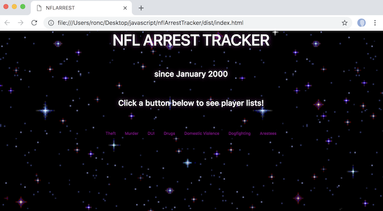
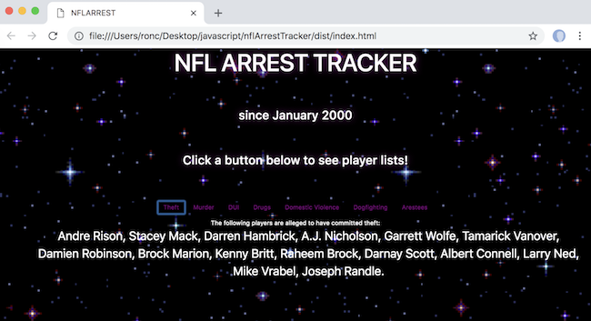

# nflArrestTracker

## An app to check viewing a list of arrested NFL atheletes (from January 2000 to present)

### Application Home Page
<kbd></kbd>

### When a user selects "theft"
<kbd></kbd>

## Epicodus two day project: started 03/20/2018

## GitHub repository: https://github.com/r-craig73/nflArrestTracker

#### By Ron Craig (https://github.com/r-craig73) & Johnny Mayer (https://github.com/johnnymayer)

## Description
#### Epicodus lesson - Using javascript and API data from http://nflarrest.com/ (http://nflarrest.com/api/) to retreive a list of arrested NFL atheletes for various crimes.

## Application Setup
* Clone the repository
* In the home directory, install webpack and npm `$ npm install`

## Running the application
* In the home directory, build the code by running `$ npm run build`
* Open `haiku_checker/dist/index.html` in a Chrome browser to run the application
* Or...
* ~~In the home directory, run `$ npm start build`.  Webpack will automatically start a development server in a web browser at http://localhost:8080/. Updates in the application will be saved instantly.~~  Not working!

## Testing setup
* Clone the repository
* In the home directory, run `$ npm test`
* View the opened Chrome browser (or copy the URL from the terminal) to view the passing/failing specs

## Issues
* Adding multiple AJAX request for related category crimes ('murder' and 'murder, gun')
* Issue starting a development server in a web browser `$ npm start build`. "ERROR in multi (webpack)-dev-server/client?http://localhost:8080 build Module not found: Error: Can't resolve 'build' in '.../nflArrestTracker' @ multi (webpack -dev-server/client?http://localhost:8080 build main[1]"
 
## Technologies Used
* HTML
* JavaScript
* Webpack and npm
* Jasmine
* Karma

## MIT License

#### Copyright (c) 2018 _Ron Craig & Johnny Mayer_